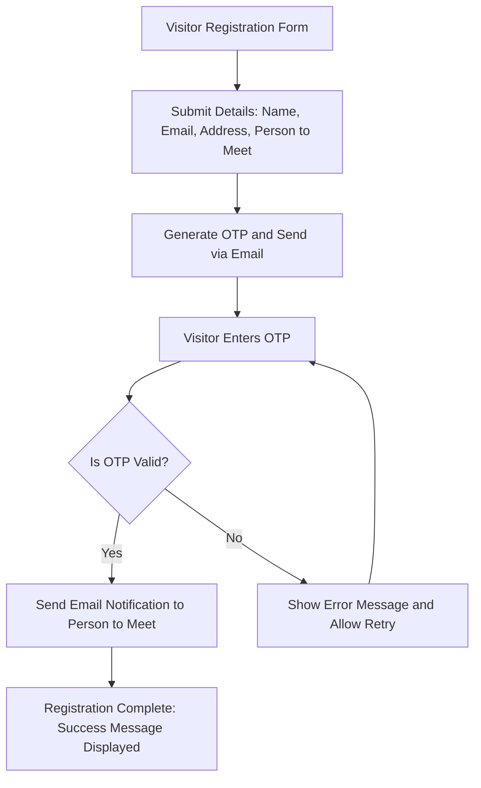
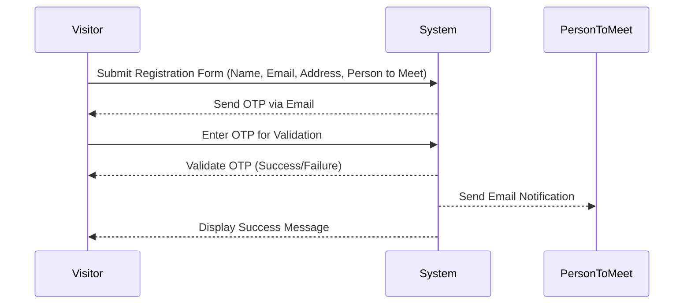
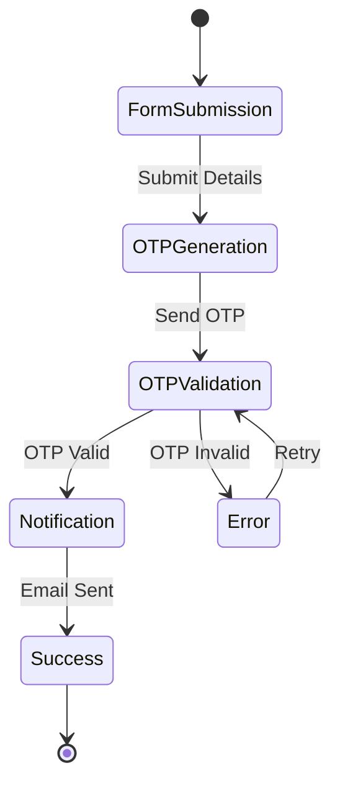
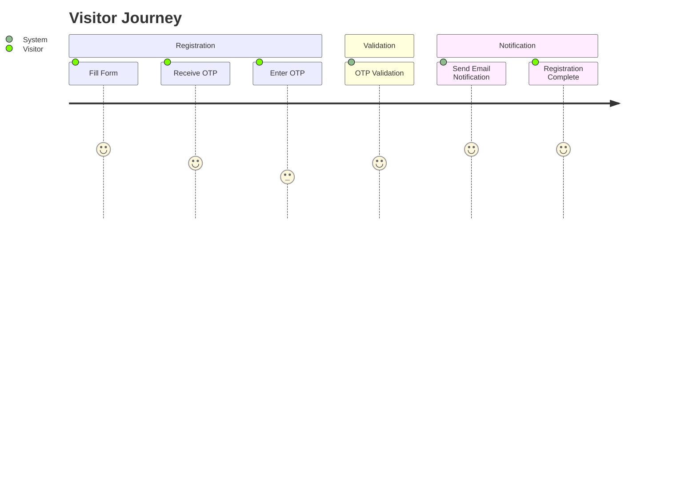

# Visitor Management System for StatusNeo

## Features in this app
- Register as visitor on web page
  - Email
  - Name
  - Mobile (not verified for now)
  - No. of guests 
  - Host whom to meet - ideally email id
    - if just name, then backend AD search integration will identify and map the correct email address
    - if no distinct user identified then email to go to default address
- OTP notification and verification of provided contact details
  - Email integration through StatusNeo Outlook
  - Requires a VMS or admin email id
- Notification email on successful registration. Also generate a regn. number.
  - To guest on registered address
  - to host whom to meet on their email address
- Email templates configuration
- Audit the visit record in the DB.

### Workflow
- Web app is opened and ready on a tab at reception. The tab will need to be connected to StatusNeo WiFi 
- Login to web app is via AD SSO, using the default VMS id.
- Visitor enters their details, receive an OTP, then validate it.
- Post validation, regn. id is generated and a visit is logged in the DB.
- Run a background cron job EOD to email the report to COO/CISO.

#### Rules
- OTP should only be verified once. Successive verifications for the same (email + OTP) combo should fail.
- Ideally OTP should be time-bound and valid for (configurable) 15-30 mins.

## Design notes
### Security
- The reason VMS login is necessary is anyone could open the web app publicly otherwise and start running attacks on open unauthenticated ports. Right now we're running on a single VM and directly exposing the port to the outside world. 
- The other option is to install a VPN server on the VM and connect it on the tablet directly. Then we don't need a VMS user login. We can also avoid a TLS certificate and public DNS, but would need a VPN license.
- 2 user roles
    - Default VMS user role to login to the app and register guests
    - Internal employee admin role to manage settings and view visit reports. This will be mapped to select few users.
- User email and mobile to be stored encrypted.

### Infra
- AWS EC2 VM with PostgreSQL installed
- StatusNeo AD SSO integration
- StatusNeo Outlook integration
- TLS public certificate for the domain

### Dev/test local infra
- Mock SMTP server
- Mock SMS server
- Local SSO server
- AWS CDK

### DevOps
Deploy with Github Action on EC2 from this repo

## Future enhancements
- Allow guests to register directly on the public web app from their devices. API endpoint security will become a factor at this point, as well as it opens up a slew of data security loopholes for unauthenticated users.
- Auto-complete search box for the host whom to meet
  - Would require current employees to be pulled and cached in the DB from AD
- There has to be a way to identify and register the device id to scale the solution past 1 device and location.
- Invalid OTP verification attempt retries to be capped (configure to 3).
  - After that contact detail is added to a blocked list. Only admin user can remove it from blocked list after that via admin UI.
- If a visitor successfully registers for a visit, they should be unable to re-register again for some (configurable) duration, typically that half day.
- The more checks we have, the more an admin UI would be necessary to manage inevitable corner cases and overrides.
- Ability to capture and store guest photo
- Ability to capture and store guest govt. id proof
- Once we capture more guest details they should autofill the guest details on successive visits based on registered email/phone.